<div align="center">

<a href="https://github.com/rafaelbitencourt1">
  
</a>

<br/>


<br/>


&nbsp;&nbsp;
<a href="https://github.com/rafaelbitencourt1?tab=followers">
  
</a>
&nbsp;&nbsp;


</div>

<br/>

<!-- Animated divider -->


<br/>

##  &nbsp;Sobre mim

<table align="center" border="0" cellspacing="0" cellpadding="0">
<tr>
<td width="55%" valign="top">

```typescript
const rafael = {
  formação: "Análise e Desenvolvimento de Sistemas",
  paixão: ["Tecnologia", "Design", "Automação"],
  atuação: "Desenvolvedor de sistemas web e apps",
  projetos: [
    "Despa Agenda",
    "NextMesa",
    "Organo",
    "BarberGo"
  ],
  objetivo: "Projetos com impacto e propósito",
  mantra: "Build. Ship. Iterate."
};
```

</td>
<td width="45%" align="center">


<br/>


</td>
</tr>
</table>

<br/>

<!-- Animated divider -->


<br/>

##  &nbsp;Tech Stack

<div align="center">
  
</div>

<br/>

<div align="center">

**`🖥️ FRONTEND`**


**`⚙️ BACKEND & DATABASE`**


**`📱 MOBILE`**


</div>

<br/>

<!-- Animated divider -->


<br/>

##  &nbsp;Projetos em destaque

<div align="center">

<!-- Despa Agenda -->
<a href="https://github.com/rafaelbitencourt1">

</a>
&nbsp;
<a href="https://github.com/rafaelbitencourt1">

</a>

</div>

<br/>

<div align="center">

<table>
<tr>
<td width="33%" align="center">


<br/><br/>

📌 Help desk com autenticação **JWT**, painel dark com sidebar e dashboard para **usuários e admins**.

<br/>


<br/>


</td>
<td width="33%" align="center">


<br/><br/>

✂️ SaaS para agendar cortes, selecionar **profissionais** e visualizar **horários disponíveis**.

<br/>


</td>
<td width="33%" align="center">


<br/><br/>

🪑 Controle de mesas, pedidos e **fluxo de clientes em tempo real**.

<br/>


</td>
</tr>
</table>

<br/>

<a href="https://github.com/rafaelbitencourt1?tab=repositories">
  
</a>

</div>

<br/>

<!-- Animated divider -->


<br/>


## 🌌 Tech Orbit — Meu Ecossistema de Desenvolvimento

```mermaid
%%{init: {'theme': 'dark', 'themeVariables': { 'primaryColor': '#00F7FF', 'primaryTextColor': '#FFFFFF', 'primaryBorderColor': '#0051FF', 'lineColor': '#00F7FF', 'secondaryColor': '#0D1117', 'tertiaryColor': '#0D1117', 'edgeLabelBackground': '#0D1117'}}}%%
graph TD
    A[⚛️ React] --> B[🟢 Node.js]
    B --> C[🐘 PostgreSQL]
    B --> D[🔐 Firebase Auth]
    A --> E[🎨 TailwindCSS]
    B --> F[â—† Prisma ORM]
    G[📱 Kotlin] --> H[🤖 Android]
    H --> I[🔥 Firebase]
    A --> |Next.js| B
    F --> C
    D --> I

    style A fill:#0D1117,stroke:#61DAFB,stroke-width:2px,color:#FFFFFF
    style B fill:#0D1117,stroke:#339933,stroke-width:2px,color:#FFFFFF
    style C fill:#0D1117,stroke:#316192,stroke-width:2px,color:#FFFFFF
    style D fill:#0D1117,stroke:#FFCA28,stroke-width:2px,color:#FFFFFF
    style E fill:#0D1117,stroke:#38B2AC,stroke-width:2px,color:#FFFFFF
    style F fill:#0D1117,stroke:#2D3748,stroke-width:2px,color:#FFFFFF
    style G fill:#0D1117,stroke:#7F52FF,stroke-width:2px,color:#FFFFFF
    style H fill:#0D1117,stroke:#3DDC84,stroke-width:2px,color:#FFFFFF
    style I fill:#0D1117,stroke:#FFCA28,stroke-width:2px,color:#FFFFFF
```

<div align="center">
<i>Este diagrama representa como as tecnologias que utilizo se conectam no desenvolvimento dos meus projetos — do front-end ao back-end, passando por mobile.</i>
</div>

<br/>



<br/>

<!-- Animated divider -->


<br/>

##  &nbsp;Vamos conversar?

<div align="center">

<a href="https://www.instagram.com/rfl_bitencourt/" target="_blank">
  
</a>
&nbsp;
<a href="https://www.linkedin.com/in/rafael-bitencourtgf/" target="_blank">
  
</a>
&nbsp;
<a href="https://portifolio-eight-mauve-22.vercel.app/" target="_blank">
  
</a>

<br/><br/>


</div>

<br/>

<!-- Snake animation -->
<div align="center">

<picture>
  <source media="(prefers-color-scheme: dark)" srcset="https://raw.githubusercontent.com/rafaelbitencourt1/rafaelbitencourt1/output/github-snake-dark.svg" />
  <source media="(prefers-color-scheme: light)" srcset="https://raw.githubusercontent.com/rafaelbitencourt1/rafaelbitencourt1/output/github-snake.svg" />
  
</picture>

</div>

<br/>

<div align="center">
  
</div>


