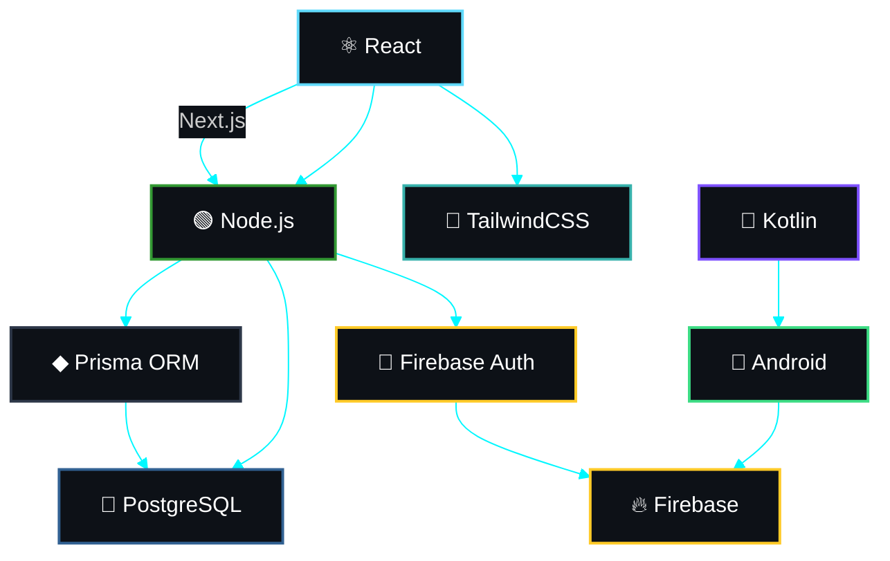

<div align="center">

<!-- Animated wave hand -->
<a href="https://github.com/rafaelbitencourt">
  
</a>

<br/>


<br/>

<!-- Profile views & followers badges -->

&nbsp;
<a href="https://github.com/rafaelbitencourt?tab=followers">
  
</a>

</div>

<br/>

<!-- Animated divider -->


<br/>

##  &nbsp;Sobre mim

<div align="center">

```typescript
const rafael = {
    formação: "Análise e Desenvolvimento de Sistemas 🎓",
    paixão: ["Tecnologia", "Design", "Automação"] 🧠,
    atuação: "Desenvolvedor de sistemas web e apps 🛠️",
    projetos: ["Despa Agenda", "NextMesa", "Organo", "BarberGo"] 🧩,
    objetivo: "Projetos com impacto e propósito 💼",
    frase: "Building scalable systems, automations and SaaS platforms."
};
```

</div>

<br/>

<div align="center">
  
  
  <br/>
  
  
</div>

<br/>

<!-- Animated divider -->


<br/>

##  &nbsp;Tecnologias que utilizo

<div align="center">
  
</div>

<br/>

<div align="center">
  
  
  
  
  
  
  <br/>
  
  
  
  
  
  
  
</div>

<br/>

<!-- Animated divider -->


<br/>

##  &nbsp;Projetos em destaque

<div align="center">

<table>
<tr>
<td width="50%" valign="top">

<h3 align="center">🔧 Despa Agenda</h3>

<div align="center">
  
  <br/><br/>
  <a href="https://github.com/rafaelbitencourt">
    
  </a>
  <br/><br/>
  <p align="center">
    📌 Help desk com autenticação <b>JWT</b>, painel dark com sidebar e dashboard para <b>usuários e administradores</b>.
  </p>
  <br/>
  
  
  
  
  
</div>

</td>

<td width="50%" valign="top">

<h3 align="center">💈 BarberGO</h3>

<div align="center">
  
  <br/><br/>
  <a href="https://github.com/rafaelbitencourt">
    
  </a>
  <br/><br/>
  <p align="center">
    ✂️ Sistema inteligente para agendar cortes, selecionar <b>profissionais</b> e visualizar <b>horários disponíveis</b>.
  </p>
  <br/>
  
  
  
</div>

</td>
</tr>

<tr>
<td width="50%" valign="top">

<h3 align="center">🍽️ NextMesa</h3>

<div align="center">
  
  <br/><br/>
  <a href="https://github.com/rafaelbitencourt">
    
  </a>
  <br/><br/>
  <p align="center">
    🪑 Controle de mesas, atendimento, pedidos e <b>fluxo de clientes em tempo real</b>.
  </p>
  <br/>
  
  
  
</div>

</td>

<td width="50%" valign="top">

<h3 align="center">🧩 Mais projetos</h3>

<div align="center">
  
  <br/><br/>
  <a href="https://github.com/rafaelbitencourt?tab=repositories">
    
  </a>
  <br/><br/>
  <p align="center">
    🚀 Confira todos os meus repositórios e projetos autorais no meu perfil!
  </p>
  <br/>
  <a href="https://github.com/rafaelbitencourt?tab=repositories">
    
  </a>
</div>

</td>
</tr>
</table>

</div>

<br/>

<!-- Animated divider -->


<br/>

##  &nbsp;Estatísticas do GitHub

<div align="center">

<a href="https://github.com/rafaelbitencourt">
  
</a>
&nbsp;&nbsp;
<a href="https://github.com/rafaelbitencourt">
  
</a>

<br/><br/>

<a href="https://github.com/rafaelbitencourt">
  
</a>

<br/><br/>

<a href="https://github.com/rafaelbitencourt">
  
</a>

</div>

<br/>

<div align="center">
  
</div>

<br/>

<!-- Animated divider -->


<br/>

## 🌌 Tech Orbit — Meu Ecossistema de Desenvolvimento

<div align="center">
<i>Este diagrama representa como as tecnologias que utilizo se conectam no desenvolvimento dos meus projetos — do front-end ao back-end, passando por mobile.</i>
</div>

<br/>



<br/>

<!-- Animated divider -->


<br/>

##  &nbsp;Vamos conversar?

<div align="center">

<a href="https://www.instagram.com/rfl_bitencourt/" target="_blank">
  
</a>
&nbsp;&nbsp;
<a href="https://www.linkedin.com/in/rafael-bitencourtgf/" target="_blank">
  
</a>
&nbsp;&nbsp;
<a href="https://portifolio-eight-mauve-22.vercel.app/" target="_blank">
  
</a>

</div>

<br/>

<!-- Snake animation -->
<div align="center">

<picture>
  <source media="(prefers-color-scheme: dark)" srcset="https://raw.githubusercontent.com/rafaelbitencourt/rafaelbitencourt/output/github-snake-dark.svg" />
  <source media="(prefers-color-scheme: light)" srcset="https://raw.githubusercontent.com/rafaelbitencourt/rafaelbitencourt/output/github-snake.svg" />
  
</picture>

</div>

<br/>

<div align="center">
  
</div>

<div align="center">
  
</div>
